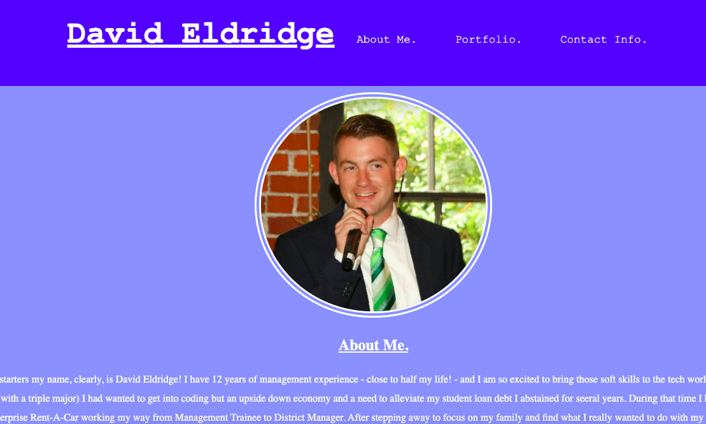
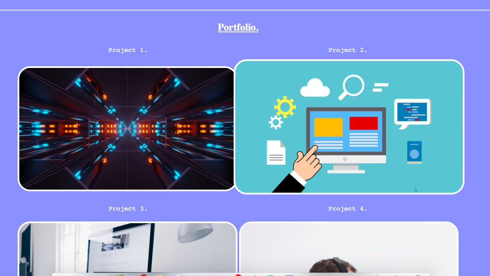
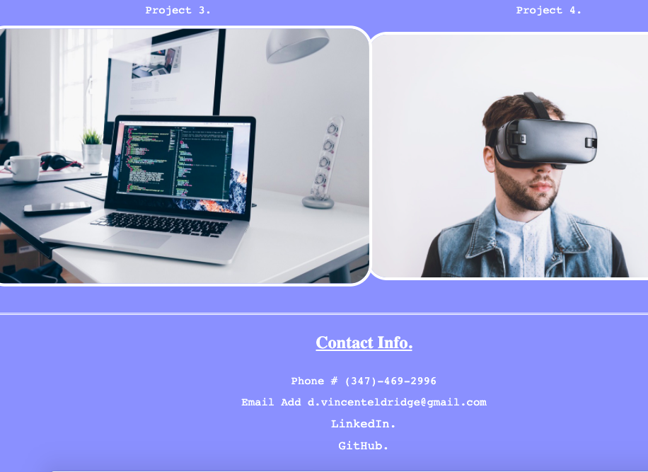

# HW 02 HTML + CSS: Beginning Portfolio

## Deployed Site:

https://daveyrojo.github.io/portfolio-html-css/

## Goal:

The goal of the assignment was to present a webpage designed with HTML and CSS. It
needed to include:

    **About Me section:**

        A section giving a brief background of myself and where I'm at with my coding journey.

        A portfolio with placeholder images to link to my future projects.

        A contact information section on how to reach me.

        Have working links in the navigation.

## Description:

My page included all of the above. I made the code as DRY as possible by going back through, checking for redundancies and effectiveness. For instance prior to turning in the homework I realized I had a few lines that were duplicating the same code and I cleaned out that code. I formatted the page to be vertical and centered with a decent level of responsiveness.

## Screen Shots:

**Top of Page**

**Middle of Page**

**Bottom of Page**

